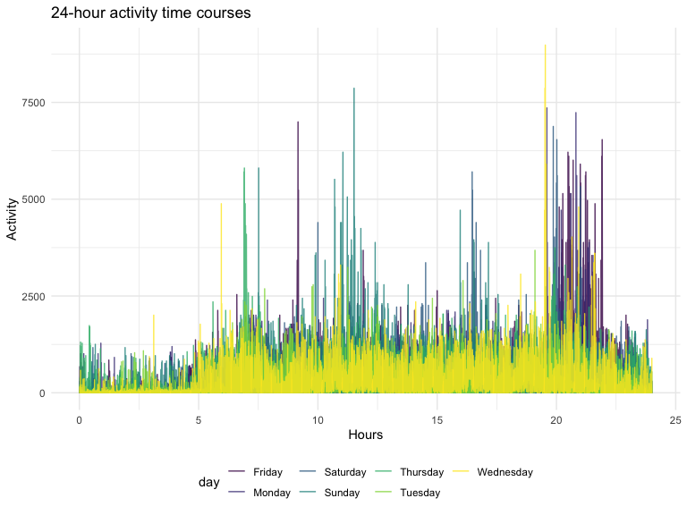
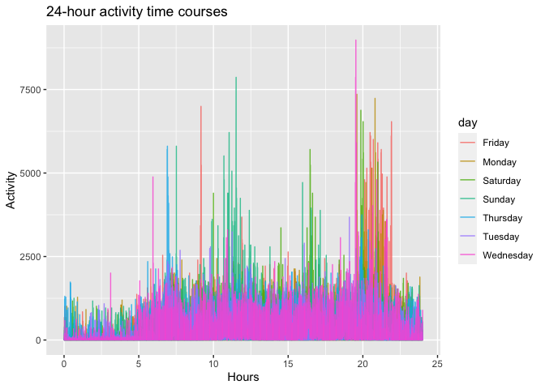
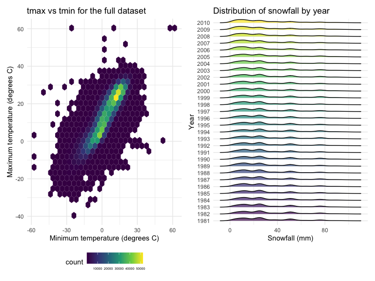
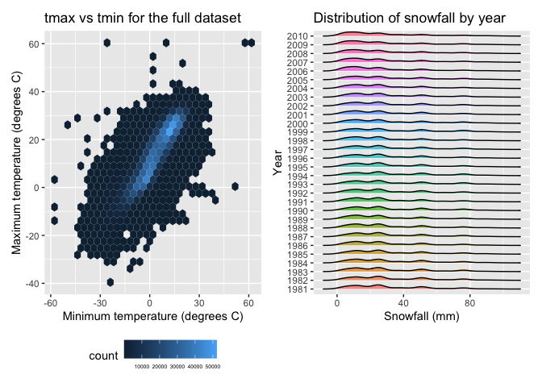

p8105_hw3_jt3387
================

``` r
library(tidyverse)
library(ggridges)
library(patchwork)
library(p8105.datasets)
```

## Problem 1

Load the dataset:

``` r
data("instacart")
instacart = instacart %>% 
  as_tibble(instacart)
```

Brief discription of the dataset:

-   This dataset contains 1384617 rows and 15 columns.

-   The dataset contains following variables:
    `order_id, product_id, add_to_cart_order, reordered, user_id, eval_set, order_number, order_dow, order_hour_of_day, days_since_prior_order, product_name, aisle_id, department_id, aisle, department`,
    and some key variables are: `order_id` represents the order
    identifier, `product_id` represents the product identifier,
    `user_id` represents the customer identifier, `aisle_id` represents
    the aisle identifier, `department_id` represents the department
    identifier.

-   In total, there are 39123 products found in 131209 orders from
    131209 distinct users.

How many aisles are there, and which aisles are the most items ordered
from?

``` r
instacart %>% 
  count(aisle) %>% 
  arrange(desc(n))
```

    ## # A tibble: 134 × 2
    ##    aisle                              n
    ##    <chr>                          <int>
    ##  1 fresh vegetables              150609
    ##  2 fresh fruits                  150473
    ##  3 packaged vegetables fruits     78493
    ##  4 yogurt                         55240
    ##  5 packaged cheese                41699
    ##  6 water seltzer sparkling water  36617
    ##  7 milk                           32644
    ##  8 chips pretzels                 31269
    ##  9 soy lactosefree                26240
    ## 10 bread                          23635
    ## # … with 124 more rows

-   In total, there are 134 aisles, and fresh vegetables and fresh
    fruits aisles are the most items ordered from.

Make a plot that shows the number of items ordered in each aisle.

``` r
instacart %>% 
  count(aisle) %>% 
  filter(n > 10000) %>% 
  mutate(aisle = fct_reorder(aisle, n)) %>% 
  ggplot(aes(x = aisle, y = n)) + 
  geom_point() + 
  labs(title = "Number of items ordered in each aisle") +
  theme(axis.text.x = element_text(angle = 60, hjust = 1))
```

<!-- -->

Make a table showing the three most popular items in each of the aisles
“baking ingredients”, “dog food care”, and “packaged vegetables fruits”.

``` r
instacart %>% 
  filter(aisle %in% c("baking ingredients", "dog food care", "packaged vegetables fruits")) %>%
  group_by(aisle) %>% 
  count(product_name) %>% 
  mutate(rank = min_rank(desc(n))) %>% 
  filter(rank < 4) %>% 
  arrange(desc(n)) %>%
  knitr::kable()
```

| aisle                      | product_name                                  |    n | rank |
|:---------------------------|:----------------------------------------------|-----:|-----:|
| packaged vegetables fruits | Organic Baby Spinach                          | 9784 |    1 |
| packaged vegetables fruits | Organic Raspberries                           | 5546 |    2 |
| packaged vegetables fruits | Organic Blueberries                           | 4966 |    3 |
| baking ingredients         | Light Brown Sugar                             |  499 |    1 |
| baking ingredients         | Pure Baking Soda                              |  387 |    2 |
| baking ingredients         | Cane Sugar                                    |  336 |    3 |
| dog food care              | Snack Sticks Chicken & Rice Recipe Dog Treats |   30 |    1 |
| dog food care              | Organix Chicken & Brown Rice Recipe           |   28 |    2 |
| dog food care              | Small Dog Biscuits                            |   26 |    3 |

Make a table showing the mean hour of the day at which Pink Lady Apples
and Coffee Ice Cream are ordered on each day of the week.

``` r
instacart %>%
  filter(product_name %in% c("Pink Lady Apples", "Coffee Ice Cream")) %>%
  group_by(product_name, order_dow) %>%
  summarize(mean_hour = mean(order_hour_of_day)) %>%
  spread(key = order_dow, value = mean_hour) %>%
  knitr::kable(digits = 2)
```

| product_name     |     0 |     1 |     2 |     3 |     4 |     5 |     6 |
|:-----------------|------:|------:|------:|------:|------:|------:|------:|
| Coffee Ice Cream | 13.77 | 14.32 | 15.38 | 15.32 | 15.22 | 12.26 | 13.83 |
| Pink Lady Apples | 13.44 | 11.36 | 11.70 | 14.25 | 11.55 | 12.78 | 11.94 |

## Problem 2

Load, tidy, and wrangle the data.

``` r
accel_df <- 
  read_csv("data/accel_data.csv") %>% 
  janitor::clean_names() %>% 
  pivot_longer(
    activity_1:activity_1440,
    names_prefix = "activity_",
    names_to = "minute",
    values_to = "activity"
  ) %>% 
  mutate(
    minute = as.numeric(minute),
    dow = ifelse(day %in% c('Saturday', 'Sunday'), "weekend", "weekday")
  ) %>% 
  relocate(week, day_id, day, dow)
```

Brief discription of the resulting dataset:

-   The data contains 50400 rows and 6 columns.

-   There are 7 variables in the data set: `week` represents the week
    number from 1 to 5, `day_id` shows the id of each day ranging from 1
    to 35, `day` shows what day of the week it is, `dow` shows whether
    the day is a weekday or weekend, `minite` represents every minute
    within a 24-hour day ranging from 1 to 1440, `activity` shows the
    activity counts for each minute of a 24-hour day starting at
    midnight, and its min value is `1` and max value is `8982`.

Analyses of the data focus on the total activity over the day.

``` r
total_act <- 
  accel_df %>% 
  group_by(week, day) %>% 
  summarize(sum_activity = sum(activity))
```

Create a table showing the totals.

``` r
total_act %>% 
  pivot_wider(
    names_from = "day",
    values_from = "sum_activity"
  ) %>% 
  relocate(1, 5, 3, 7, 8, 6, 2, 4) %>% 
  knitr::kable(
    caption = "Total activity over a day",
    align = "l"
  )
```

| week | Sunday | Monday    | Tuesday  | Wednesday | Thursday | Friday   | Saturday |
|:-----|:-------|:----------|:---------|:----------|:---------|:---------|:---------|
| 1    | 631105 | 78828.07  | 307094.2 | 340115    | 355923.6 | 480542.6 | 376254   |
| 2    | 422018 | 295431.00 | 423245.0 | 440962    | 474048.0 | 568839.0 | 607175   |
| 3    | 467052 | 685910.00 | 381507.0 | 468869    | 371230.0 | 467420.0 | 382928   |
| 4    | 260617 | 409450.00 | 319568.0 | 434460    | 340291.0 | 154049.0 | 1440     |
| 5    | 138421 | 389080.00 | 367824.0 | 445366    | 549658.0 | 620860.0 | 1440     |

Total activity over a day

Plot the data to see if there is a trend:

``` r
total_act %>% 
  mutate(
    day = factor(day, levels = c('Monday', 'Tuesday', 'Wednesday', 'Thursday', 'Friday', 'Saturday', 'Sunday'))
  ) %>% 
  ggplot(aes(x = day, y = sum_activity, group = week, color = week)) + 
  geom_point() + 
  geom_line()
```

<!-- -->

-   From the chart, we can see that the total activity count in five
    weeks has been fluctuating, and the fluctuations in the forth and
    fifth weeks are relatively greater. Overall, the total activity
    number on weekends is relatively lower than on weekdays.

Make a plot to shows the 24-hour activity time courses for each day.

``` r
accel_df %>% 
  mutate(hour = minute / 60) %>% 
  ggplot(aes(x = hour, y = activity, color = day)) + 
  geom_line(alpha = 0.8) + 
  labs(
    x = "Hours",
    y = "Activity",
    title = "24-hour activity time courses"
  )
```

<!-- -->

-   From the plot, we can see that the activity counts are much lower
    from 11:00 pm to 5:00 am in the midnight and early morning,
    whichcorresponds to the sleep time, and the high activity counts are
    concentrated from 9:00 am to 12:00 am and 8:00 pm to 10:00 pm. Then
    a moderate activity counts appears from 4:00 pm to 5:00 pm.

## Problem 3

Load and summary the dataset.

``` r
data("ny_noaa")
ny_noaa <- ny_noaa %>% 
  mutate(tmin = as.numeric(tmin), 
         tmax = as.numeric(tmax)) %>% 
  as_tibble(ny_noaa)
summary(ny_noaa)
```

    ##       id                 date                 prcp               snow       
    ##  Length:2595176     Min.   :1981-01-01   Min.   :    0.00   Min.   :  -13   
    ##  Class :character   1st Qu.:1988-11-29   1st Qu.:    0.00   1st Qu.:    0   
    ##  Mode  :character   Median :1997-01-21   Median :    0.00   Median :    0   
    ##                     Mean   :1997-01-01   Mean   :   29.82   Mean   :    5   
    ##                     3rd Qu.:2005-09-01   3rd Qu.:   23.00   3rd Qu.:    0   
    ##                     Max.   :2010-12-31   Max.   :22860.00   Max.   :10160   
    ##                                          NA's   :145838     NA's   :381221  
    ##       snwd             tmax              tmin        
    ##  Min.   :   0.0   Min.   :-389.0    Min.   :-594.0   
    ##  1st Qu.:   0.0   1st Qu.:  50.0    1st Qu.: -39.0   
    ##  Median :   0.0   Median : 150.0    Median :  33.0   
    ##  Mean   :  37.3   Mean   : 139.8    Mean   :  30.3   
    ##  3rd Qu.:   0.0   3rd Qu.: 233.0    3rd Qu.: 111.0   
    ##  Max.   :9195.0   Max.   : 600.0    Max.   : 600.0   
    ##  NA's   :591786   NA's   :1134358   NA's   :1134420

Brief description of the dataset:

-   The data contains 2595176 rows and 7 columns.

-   The dataset contains following variables:
    `id, date, prcp, snow, snwd, tmax, tmin`, and some key variables
    are: `id` represents the weather station ID, `data` represents the
    date of observation, `prcp` represents precipitation(tenths of mm),
    `snow` represents snowfall(mm), `snwd` represents snow depth(mm),
    `tmax` represents maximum temperature (tenths of degrees C), `tmin`
    represents minimun temperature(tenths of degrees C).

-   The data was collected by 747 weather stations from 01/01/1981 to
    12/31/2010. By using `summary` function, we can also see that there
    are lots of missing values in variables: `prcp`, `snow`, `snwd`,
    `tmax`, `tmin`, and nearly 5.6% of `prcp`, 14.7% of `snow`, 22.8% of
    `snwd`, and over 40% of `tmin` and `tmax` values are missing. If the
    missing is not at random, there will be bias in the data and further
    statistical analysis result will be affected.

Clean the data.

``` r
ny_noaa <- ny_noaa %>%
  janitor::clean_names() %>%
  separate(date, into = c('year', 'month', 'day'), sep = "-") %>%
  mutate(
    tmax = tmax/10,
    tmin = tmin/10,
    prcp = prcp/10,
    year = as.numeric(year),
    month = as.numeric(month),
    day = as.numeric(day))
```

-   We should divide `tmin`, `tmax`, `prcp` by 10 to keep them in
    degrees C and mm. Then as we convert `tmin`, `tmax` into numeric
    before, we will also convert `year`, `month`, `day` into numeric
    format.

Quantitative analysis of snowfall.

``` r
ny_noaa %>%
  group_by(snow) %>%
  summarise(snowfall_obs = n()) %>%
  arrange(desc(snowfall_obs))
```

    ## # A tibble: 282 × 2
    ##     snow snowfall_obs
    ##    <int>        <int>
    ##  1     0      2008508
    ##  2    NA       381221
    ##  3    25        31022
    ##  4    13        23095
    ##  5    51        18274
    ##  6    76        10173
    ##  7     8         9962
    ##  8     5         9748
    ##  9    38         9197
    ## 10     3         8790
    ## # … with 272 more rows

-   Therefore, the most commonly observed values for snowfall is 0.
    Because snow only occurs in some of the winter days, most of the
    time in a year there is no snowfall.

Make a two-panel plot showing the average max temperature in January and
in July in each station across years.

``` r
ny_noaa %>%
  mutate(month = month.name[month]) %>%
  group_by(id, year, month) %>%
  filter(month %in% c ("January", "July")) %>%
  summarise(mean_tmax = mean(tmax, na.rm = TRUE)) %>%
  ggplot(aes(x = year, y = mean_tmax, color = month)) +
  geom_point() +
  geom_smooth() +
  labs(x = "Year", y = "Average Max Temperature",
       title = "Average max temperature in January and in July from 1981 to 2010") +
  theme(legend.position = "bottom") +
  facet_grid(.~month)
```

<!-- -->

-   From the plot, we can see that the average max temperature in
    January from 1980 to 2010 was approximately fluctuating around 0
    degree C on a ten-year cycle, while in July the average max
    temperature was approximately fluctuating around 27 degree C
    slightly. There are many outliers in the data, like the lowest
    temperature point in January in 1982 and lowest temperature point in
    July in 1988.

Make a two-panel plot showing:

1)  tmax vs tmin for the full dataset (note that a scatterplot may not
    be the best option);

2)  make a plot showing the distribution of snowfall values greater than
    0 and less than 100 separately by year.

``` r
tmax_tmin <- ny_noaa %>%
  ggplot(aes(x = tmin, y = tmax)) + 
  geom_hex() + 
  labs(x = "Minimum temperature (degrees C)", y = "Maximum temperature (degrees C)", 
       title = "tmax vs tmin for the full dataset") +
  theme(legend.text = element_text(size = 5), legend.position = "bottom")

snowfall_dis <- ny_noaa %>%
  filter(snow > 0 & snow < 100) %>%
  mutate(year = as.character(year)) %>%
  ggplot(aes(x = snow, y = year, fill = year)) +
  geom_density_ridges(alpha = .7, scale = .5) +
  labs(x = "Snowfall (mm)",y = "Year", title = "Distribution of snowfall by year") +
  theme(legend.position = "none")

tmax_tmin+snowfall_dis
```

<!-- -->

-   From the first plot, we can see that there are lots of points on
    which the min temperature is around 15 degrees C while the max
    temperature is around 22 degrees C, and min temperature is around 0
    degrees C while the max temperature is around 3 degrees C. The
    distribution of points is concentrated, and there are also some
    outliers. From the second plot, which shows the distribution of the
    snowfall between 0 and 100, we can see that the overall distribution
    from different years didn’t change much, and most of the snowfall
    amounts are concentrated around 10 mm, 23mm, and 50mm.
